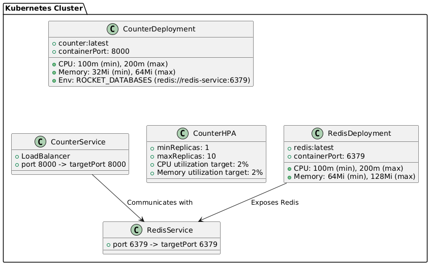

# Kubernetes Deploy Test

This test demonstrates how to deploy a simple web application to a Kubernetes cluster. The application, named "counter," is a web app that interacts with a Redis server to maintain a global count.

The following endpoints are available in the application:

| Method | Endpoint | Description                                                                               |
| ------ | -------- | ----------------------------------------------------------------------------------------- |
| GET    | `/count` | Retrieves the current count and the hostname of the pod where the application is running. |
| POST   | `/count` | Increments the current count by 1 and updates the count in the Redis server.              |
| GET    | `/total` | Retrieves the total number of requests made, as stored in Redis.                          |

## Architecture

[](./images/architecture.png)

## Requirements

To follow this tutorial, ensure you have the following tools installed:

- **minikube**: A tool for running Kubernetes clusters locally.
- **kubectl**: Command-line tool for interacting with Kubernetes clusters.
- **docker**: Tool for building and managing Docker containers.

Additionally, ensure the `metrics-server` addon is enabled in minikube to monitor CPU and memory usage of the pods:

> **Note**: Enable the `metrics-server` with the command:  
> `minikube addons enable metrics-server`

## Step 1: Start minikube

Start the minikube cluster with the following command:

```bash
minikube start
```

## Step 2: Build the Docker Image

Build the Docker image for the application:

```bash
cd counter && docker build -t counter:latest .
```

## Step 3: Add the Docker Image to minikube

Load the built Docker image into the minikube cluster:

```bash
minikube image load counter:latest
```

## Step 4: Deploy the Application

Deploy the application to Kubernetes using the following command:

```bash
kubectl apply -f .
```

## Step 5: Access the Minikube Dashboard

To monitor your deployment and see pod details, access the minikube dashboard:

```bash
minikube dashboard
```

## Step 6: Enable minikube Tunnel

To expose your application locally, run:

```bash
minikube tunnel
```

## Step 7: Access the Application

You can access the application by visiting the following URL in your browser:

- **Current count and hostname**: [http://127.0.0.1:8000/count](http://127.0.0.1:8000/count)

This will display the current count stored in Redis and the hostname of the pod where the application is running.

## Step 8: Stress Test the Application

Use a load testing tool like `autocannon` to stress-test the application. You should observe the pods automatically scaling up and down based on CPU and memory usage.

```bash
npx autocannon -c 100 -a 1000000 -m POST http://127.0.0.1:8000/count
```

This command will send a large number of requests to the `/count` endpoint, causing the application to scale in response to the increased load.
